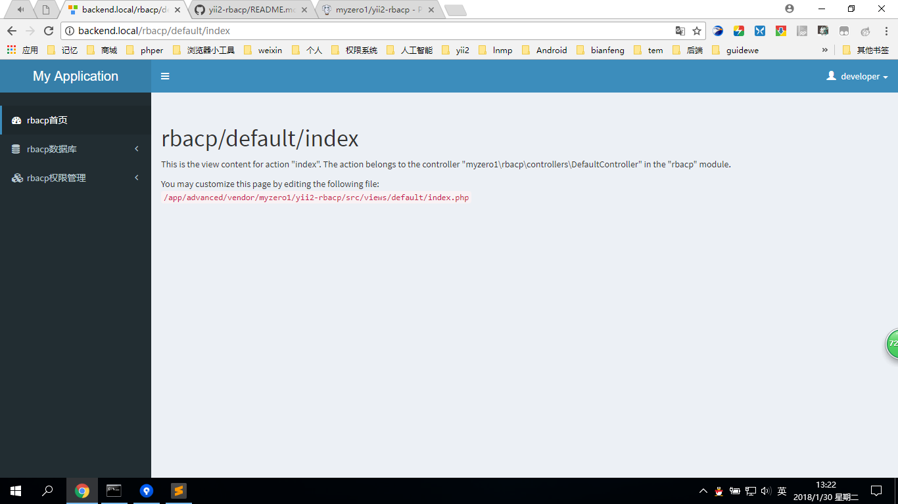
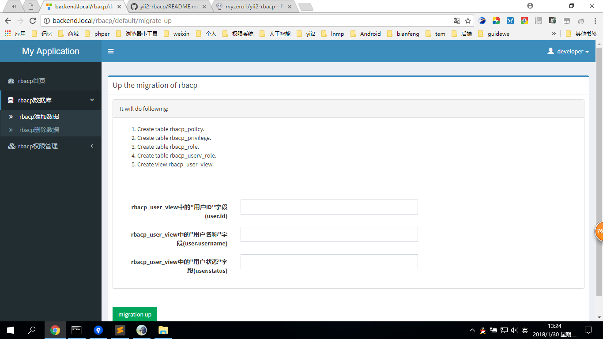
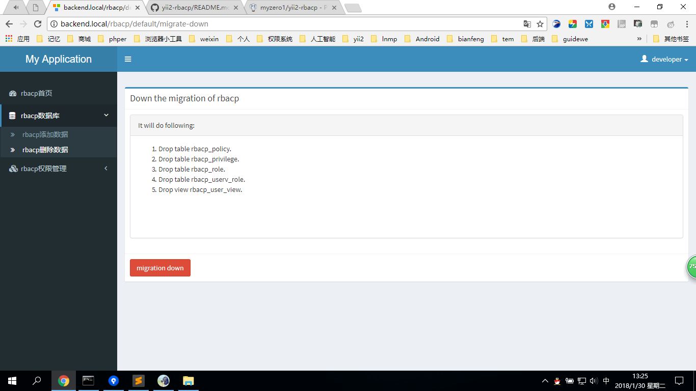
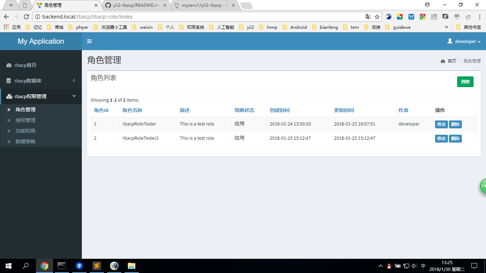
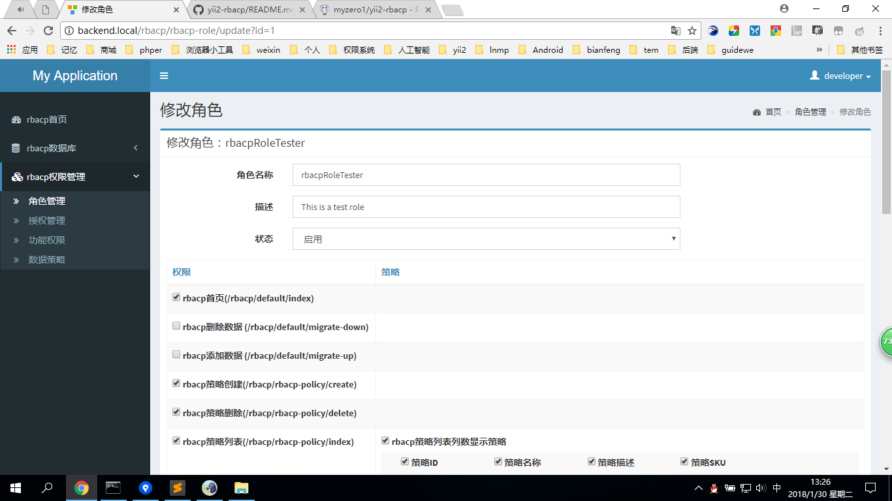
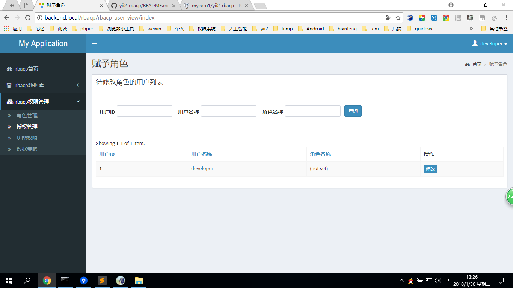
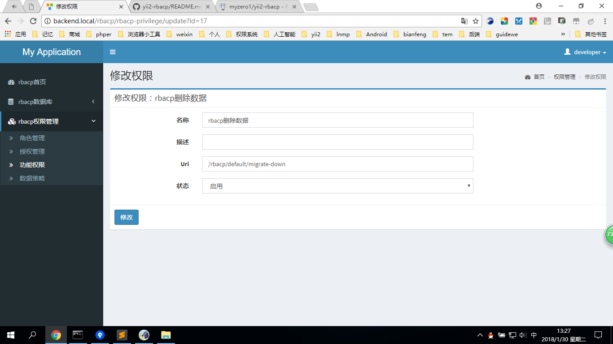
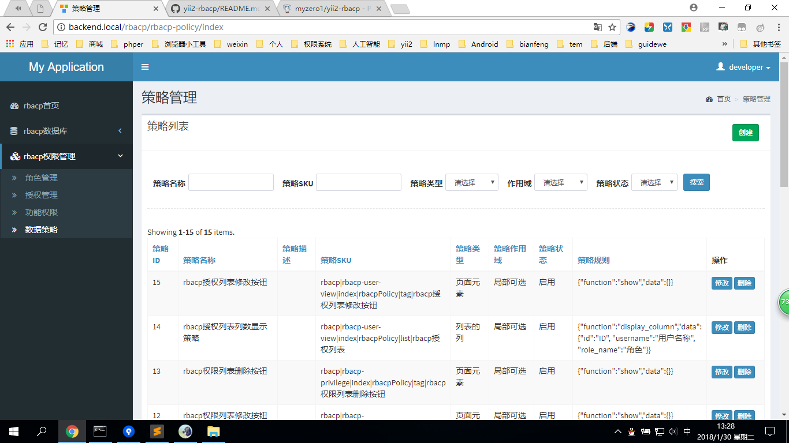
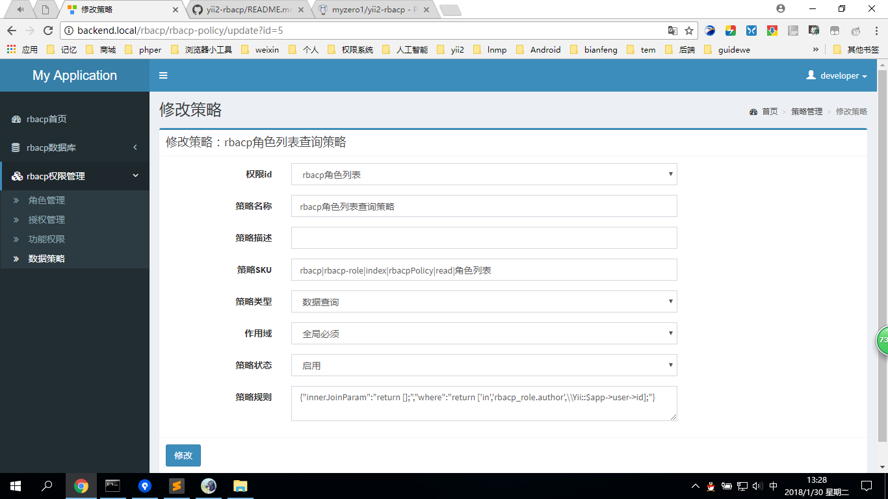

yii2-rbacp
========================

Access modules,including functional access and data access.

Screenshot
------------













Installation
------------

The preferred way to install this module is through [composer](http://getcomposer.org/download/).

Either run

```
php composer.phar require myzero1/yii2-rbacp：1.*
```

or add

```
"myzero1/yii2-rbacp": "~1"
```

to the require section of your `composer.json` file.


Setting
-----

Once the extension is installed, simply modify your application configuration as follows:

```php
return [
    // ...
    'bootstrap' => [
        'captcha',
        ...
        'rbacp' => [
            'class' => \myzero1\rbacp\Bootstrap::class, // for rbacp function
            // 'params' => [
            //    'urlManager' => [
            //         'rules' => [
            //             // 'rate/area/index' => 'rate/jf-core-area/index',
            //         ],
            //     ],
            //     'rbacp' => [
            //         'model' => 'rbac',//everyone,logined,rbac,rbacp
            //         'develop' => 1,//The id of the developer
            //         'rbacpTester' => 2,//The id of the tester of rbacp
            //         'denyCallbackUri' => '/rbacp/default/rbacp403',
            //         'loginUri' => '/site/login',
            //         'accessRules' => [
            //             'excludeUri' => [
            //                 '/rbacp/default/index',
            //                 '/rbacp/default/rbacp403',
            //                 '/site/captcha',
            //                 '/site/login-ajax',
            //             ],
            //             'developUri' => [
            //                 '/rbacp/default/migrate-up',
            //                 '/rbacp/default/migrate-down',
            //             ],
            //         ],
            //     ],
            // ],
        ],
    ],
    // ...
];
```


Usage
-----


You can access Demo through the following URL:

```
http://localhost/path/to/index.php?r=rbacp/default/index
```

or if you have enabled pretty URLs, you may use the following URL:

```
http://localhost/path/to/index.php/rbacp/default/index
```

##### Use the rbac of rbacp: #####

```

Setting 'model' => 'rbac',//everyone,logined,rbac,rbacp
    everyone: veryone can access.
    logined: Only the logined can access.
    rbac: Control access by rbac,you should to setting more.
        Add tables by "/rbacp/default/migrate-up".
        Add privilege by "rbacp-privilege/index".
        Add role by "rbacp/rbacp-role/index".
        Assign role by "rbacp/rbacp-user-view/index".
    The rbac it working,now.

```

##### Use the rbacp of rbacp: ##### 

```

Setting 'model' => 'rbacp',//everyone,logined,rbac,rbacp
    rbacp: Control access by rbacp,you should to setting more.
        Add tables by "/rbacp/default/migrate-up".
        Add privilege by "rbacp-privilege/index".
        Add policy by "rbacp/rbacp-policy/index".//to control the access of data
        Add role by "rbacp/rbacp-role/index".
        Assign role by "rbacp/rbacp-user-view/index".
    You can use rbacp as flow.
        Use it by andFilterWhere
            RbacpRole::find()->andFilterWhere([
                '<>', 
                'rbacp_role.id', 
                'rbacp_policy_sku=rbacp|rbacp-role|index|rbacpPolicy|read|角色列表'// to use rbacp, set policy_sku.
            ])
        Use it by GridView::widget
            GridView::widget([
                'dataProvider' => $dataProvider,
                'options' => [
                    'rbacp_policy_sku' => 'rbacp|rbacp-role|index|rbacpPolicy|list|角色列表'// to use rbacp, set policy_sku.
                ],
                'columns' => [...],
            ]);
        Use it by BaseHtml::tag
            yii\helpers\BaseHtml::tag('a', '创建', array(
                    'href' => yii\helpers\Url::toRoute(['create']),
                    'class' => 'btn btn-success btn-sm',
                    'rbacp_policy_sku' => 'rbacp|rbacp-role|index|rbacpPolicy|tag|角色列表创建按钮'// to use rbacp, set policy_sku.
                ));
            

```

##### Set the role id: ##### 

```
\myzero1\rbacp\components\Rbac::setRoleId($roleId);

```


##### Set and get the role id by user id: ##### 

```
\myzero1\rbacp\components\Rbac::getRoleByUid($userId);

```